# 系统架构设计师论文：深度拆解 + 全知识点思维导图
> **Work 任务包｜消费金融脱敏项目版｜2026 年 10 月备考**

## 0. 使用说明

这份材料基于以下资料整理：

1. 《论文写作宝典.pdf》
2. 《论文押题_6.0.1.pdf》
3. 之前 Perplexity 中围绕“消费金融 + iOS 开发转全局架构师视角”的讨论

本文件分成两层：

- **【资料原意】**：严格按照资料的写作要求、评分逻辑、押题框架与训练方法整理。
- **【教练提炼】**：在不改变资料核心要求的前提下，把内容转成你更容易记忆、练习和迁移到消费金融项目中的方法。

你的固定项目背景：

> **某大型持牌消费金融机构线上消费信贷平台**

你的考试身份：

> **项目核心技术人员 / 总体架构设计与关键技术方案参与者**

你的真实岗位虽然是 iOS 开发，但考试写作必须站在**全局架构师视角**，关注业务目标、系统边界、服务协作、数据流、技术选型、性能、可靠性、一致性、安全合规、运维治理和演进。

---

# 1. 先理解：论文到底在考什么？

## 【资料原意】

论文评分不是“技术名词背得多不多”，核心维度包括：

- 切合题意
- 应用深度与水平
- 实践性
- 表达能力
- 综合分析能力

资料特别强调：**实践性和真实性是能否及格的重要因素**。虚构、不可信、照抄书本、内容空洞、跑题，都可能直接导致不及格。

## 【教练提炼】

你可以把论文理解为一场：

> **“我作为架构师，面对一个真实业务问题，为什么这样设计、怎么实施、遇到什么问题、如何验证”的项目答辩。**

不是知识问答，也不是技术博客。

### 思维导图：论文真正考察什么

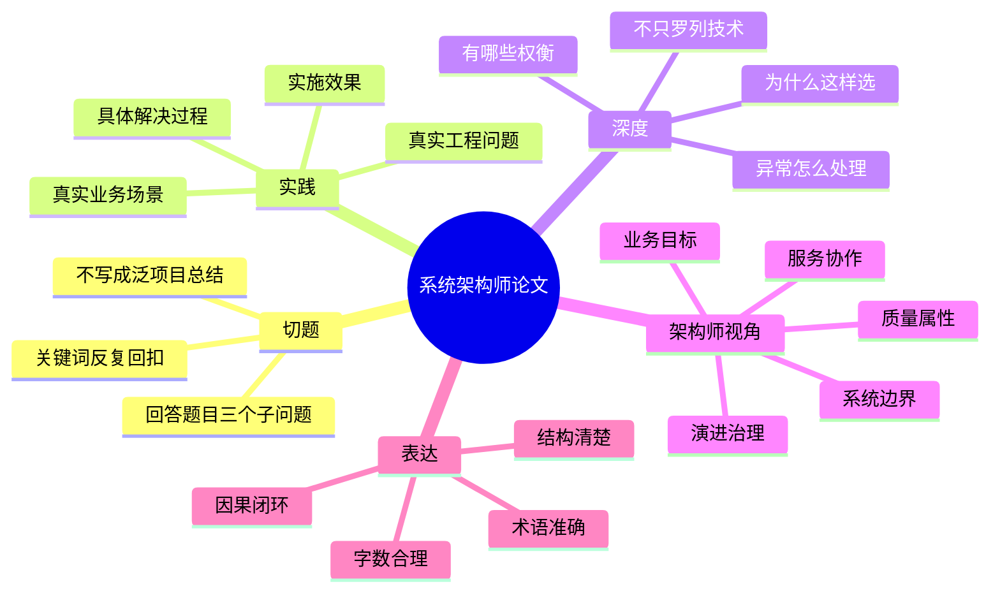
```mermaid
mindmap
  root((系统架构师论文))
    切题
      回答题目三个子问题
      关键词反复回扣
      不写成泛项目总结
    实践
      真实业务场景
      真实工程问题
      具体解决过程
      实施效果
    深度
      为什么这样选
      有哪些权衡
      异常怎么处理
      不只罗列技术
    架构师视角
      业务目标
      系统边界
      服务协作
      质量属性
      演进治理
    表达
      结构清楚
      因果闭环
      术语准确
      字数合理
```

---

# 2. 考场结构与字数：先搭“固定骨架”

## 【资料原意】

建议结构：

- 摘要：约 300 字，且不能超过 300 字
- 项目背景：约 500 字
- 技术方法说明：约 500 字
- 论点展开：约 1000 字
- 论文结尾：约 400 字
- 正文机考上限：2500 字

资料明确提出：

> 摘要 + 项目简介/背景 + 结尾，大约有 1200 字可以提前形成自己的稳定模板。

## 【教练提炼】

实际训练不要压线，推荐：

| 部分 | 训练目标 |
|---|---:|
| 摘要 | 260～290 |
| 背景 | 400～450 |
| 理论 | 350～450 |
| 核心实践 | 900～1000 |
| 结尾 | 280～320 |

这样留出考场修改余量。

### 思维导图：整篇论文结构

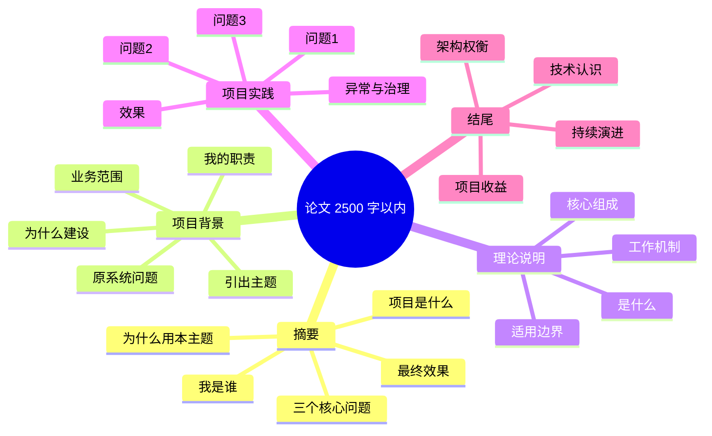
```mermaid
mindmap
  root((论文 2500 字以内))
    摘要
      项目是什么
      我是谁
      为什么用本主题
      三个核心问题
      最终效果
    项目背景
      为什么建设
      业务范围
      原系统问题
      我的职责
      引出主题
    理论说明
      是什么
      核心组成
      工作机制
      适用边界
    项目实践
      问题1
      问题2
      问题3
      异常与治理
      效果
    结尾
      项目收益
      技术认识
      架构权衡
      持续演进
```

---

# 3. 审题：所有论文第一原则

## 【资料原意】

押题范文通常按三个问题组织：

1. 概要叙述项目及本人工作
2. 说明某技术的主要内容/架构组成/基本原理
3. 结合项目说明具体设计、实施、问题解决及效果

资料明确要求：**三个问题必须在论文中逐一回应。**

## 【教练提炼】

考场拿到题后不要马上写。

先做一张“题目翻译表”：

| 原题要求 | 你脑内翻译 |
|---|---|
| 概要叙述项目 | 固定消费金融项目背景 |
| 主要组成/原理 | 理论部分 |
| 结合项目设计实现 | 三个实践分论点 |
| 实际问题 | 至少一个真实工程故障/异常 |
| 应用效果 | 有指标、有业务收益 |

### 思维导图：审题流程

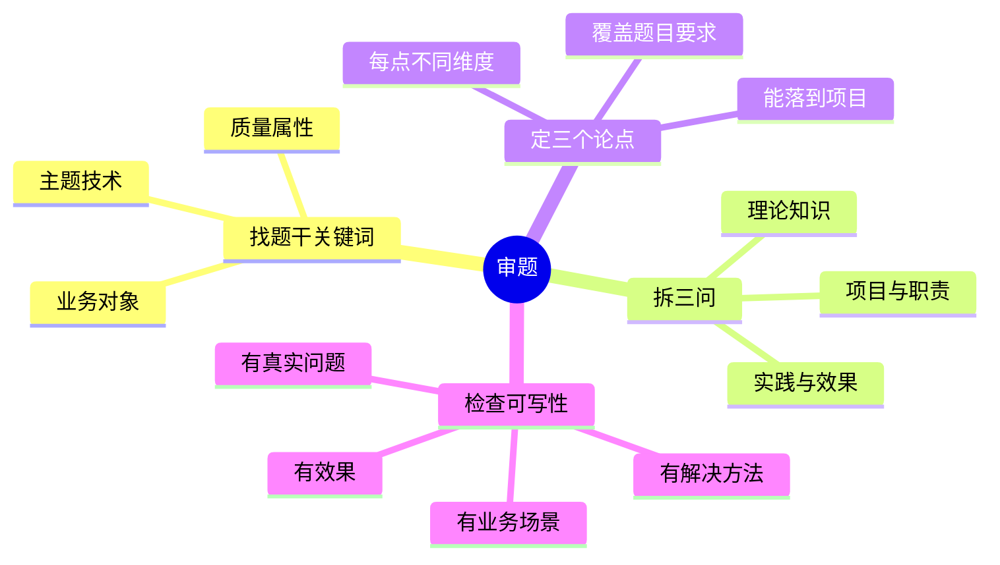
```mermaid
mindmap
  root((审题))
    找题干关键词
      主题技术
      业务对象
      质量属性
    拆三问
      项目与职责
      理论知识
      实践与效果
    定三个论点
      每点不同维度
      覆盖题目要求
      能落到项目
    检查可写性
      有业务场景
      有真实问题
      有解决方法
      有效果
```

---

# 4. 项目底座：一篇论文能不能写稳，取决于这里

## 【资料原意】

资料反复强调：

- 不要死背范文
- 要形成自己的项目
- 最好准备 PRD / 项目素材
- 项目名称、目标、业务场景、个人职责、技术选型、实施过程、实际问题都要个性化
- 背景要体现对整个项目的理解，而不是堆技术栈

## 【教练提炼】

你的万能项目固定为：

> **某大型持牌消费金融机构线上消费信贷平台**

核心业务链：

> 获客 → 申请 → 身份核验 → 风控 → 授信 → 借款 → 合同 → 放款 → 账务 → 还款 → 贷后

核心架构层：

> 渠道接入 → 业务受理 → 风控审批 → 核心信贷 → 资金账务 → 贷后运营 → 公共支撑

### 思维导图：消费金融项目底座

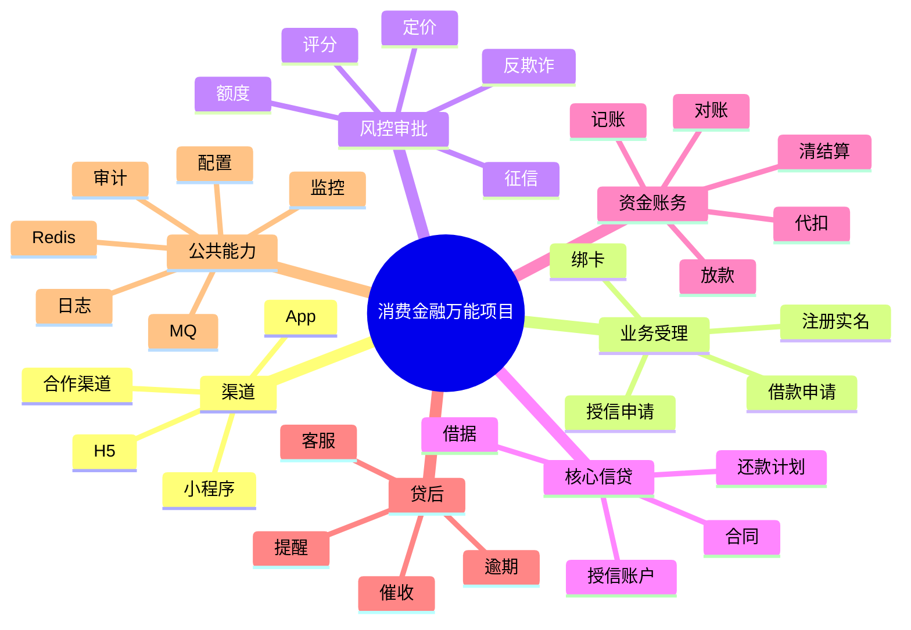
```mermaid
mindmap
  root((消费金融万能项目))
    渠道
      App
      H5
      小程序
      合作渠道
    业务受理
      注册实名
      绑卡
      授信申请
      借款申请
    风控审批
      反欺诈
      征信
      评分
      额度
      定价
    核心信贷
      授信账户
      借据
      合同
      还款计划
    资金账务
      放款
      代扣
      记账
      清结算
      对账
    贷后
      提醒
      逾期
      催收
      客服
    公共能力
      MQ
      Redis
      配置
      日志
      监控
      审计
```

---

# 5. 架构师视角：从 iOS 开发跳到全局

## 【教练提炼】

你真实最熟悉的是：

> “用户点了按钮 → App 发请求 → 接口返回”

论文需要继续追问：

> “这个按钮后面有哪些系统？谁做风控？谁扣额度？谁生成借据？谁放款？谁记账？失败如何补偿？日志如何追踪？如何审计？”

这是你最重要的思维转换。

### 思维导图：前端视角 → 架构师视角

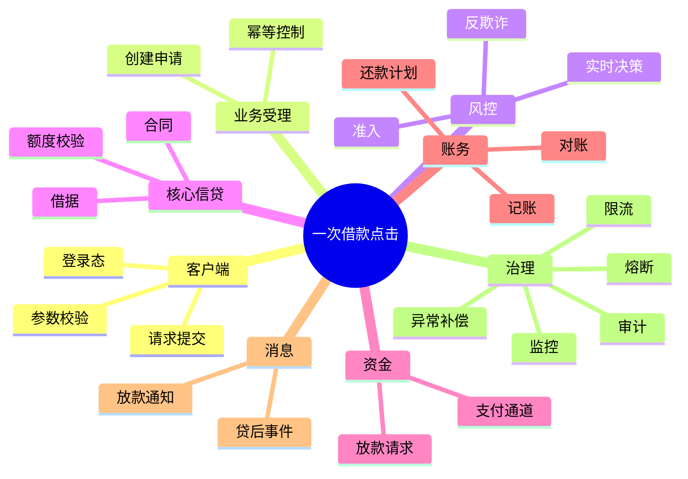
```mermaid
mindmap
  root((一次借款点击))
    客户端
      参数校验
      登录态
      请求提交
    业务受理
      创建申请
      幂等控制
    风控
      准入
      反欺诈
      实时决策
    核心信贷
      额度校验
      合同
      借据
    资金
      放款请求
      支付通道
    账务
      记账
      还款计划
      对账
    消息
      放款通知
      贷后事件
    治理
      限流
      熔断
      监控
      审计
      异常补偿
```

---

# 6. 摘要：不是背景缩写，而是“整篇论文预告片”

## 【资料原意】

摘要要体现：

- 项目核心领域与目标
- 个人角色
- 本文主题
- 技术视角/创新点
- 最终效果

不能过于模板化。

## 【教练提炼】

摘要公式：

> **行业/业务变化 → 项目 → 我的架构职责 → 主题问题 → 技术方案 → 三个实践点 → 效果 → 本文论述主题**

### 思维导图：摘要

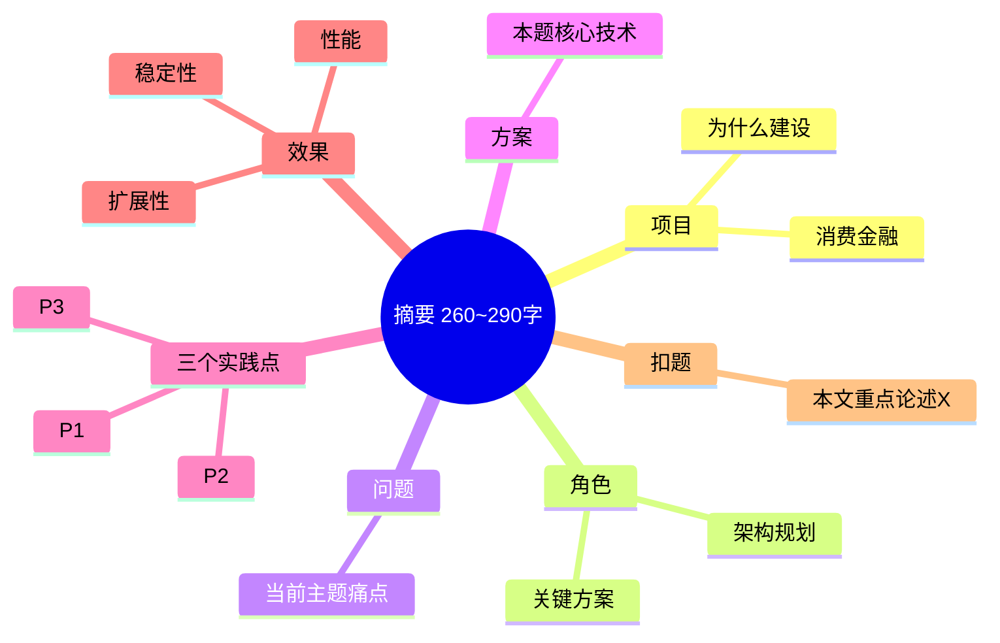
```mermaid
mindmap
  root((摘要 260~290字))
    项目
      消费金融
      为什么建设
    角色
      架构规划
      关键方案
    问题
      当前主题痛点
    方案
      本题核心技术
    三个实践点
      P1
      P2
      P3
    效果
      性能
      稳定性
      扩展性
    扣题
      本文重点论述X
```

---

# 7. 项目背景：重点考“站位”

## 【资料原意】

项目背景不是写：

> Spring Boot + Redis + MySQL + Vue……

而要写：

- 为什么公司要建这个系统
- 项目对业务有什么意义
- 项目有哪些行业特色模块
- 个人承担什么职责
- 项目边界与规模

## 【教练提炼】

背景公式：

> **行业变化 → 原系统问题 → 公司为什么立项 → 系统覆盖哪些核心业务 → 外部集成 → 我的职责 → 引出本题**

### 思维导图：项目背景

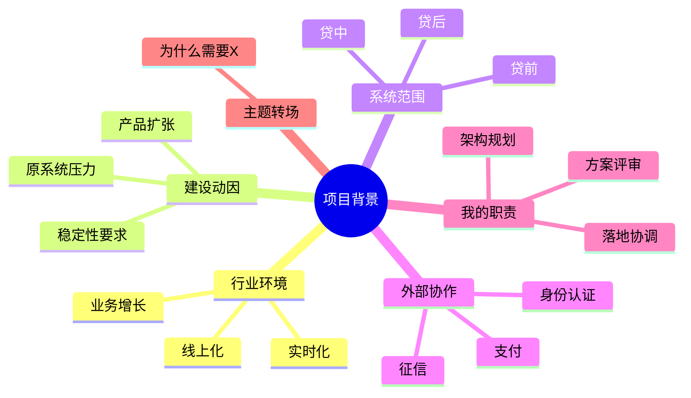
```mermaid
mindmap
  root((项目背景))
    行业环境
      线上化
      实时化
      业务增长
    建设动因
      原系统压力
      产品扩张
      稳定性要求
    系统范围
      贷前
      贷中
      贷后
    外部协作
      身份认证
      征信
      支付
    我的职责
      架构规划
      方案评审
      落地协调
    主题转场
      为什么需要X
```

---

# 8. 理论说明：只写“够用的理论”

## 【资料原意】

理论部分是回应问题 2。

不应该完全跳过，也不应把正文写成教材摘抄。

## 【教练提炼】

理论段统一五步：

> **定义 → 组成 → 工作机制 → 优缺点/边界 → 为什么适合本项目**

### 思维导图：理论段

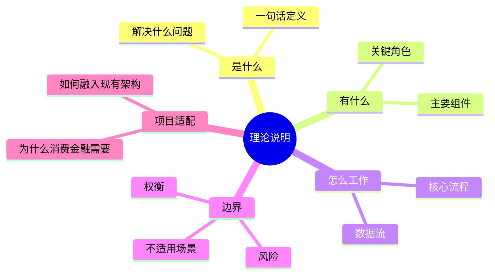
```mermaid
mindmap
  root((理论说明))
    是什么
      一句话定义
      解决什么问题
    有什么
      主要组件
      关键角色
    怎么工作
      核心流程
      数据流
    边界
      不适用场景
      风险
      权衡
    项目适配
      为什么消费金融需要
      如何融入现有架构
```

---

# 9. 核心实践：论文最重要的 1000 字

## 【资料原意】

论点展开要：

- 接地气
- 用自己的理解
- 有“架构师”视角
- 有干货
- 不只是技术名词

## 【教练提炼】

每个实践段强制采用：

> **问题 → 原因 → 方案 → 实施 → 异常 → 效果**

三段实践最好分别写：

1. 架构设计问题
2. 数据/一致性/可靠性问题
3. 线上异常与治理问题

### 思维导图：核心实践段

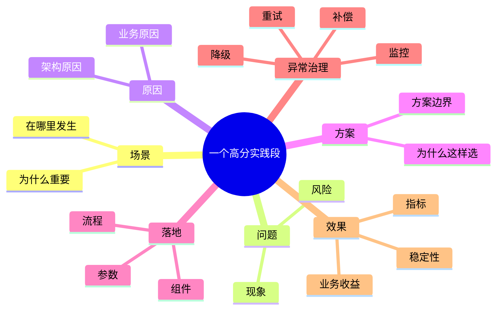
```mermaid
mindmap
  root((一个高分实践段))
    场景
      在哪里发生
      为什么重要
    问题
      现象
      风险
    原因
      架构原因
      业务原因
    方案
      为什么这样选
      方案边界
    落地
      组件
      流程
      参数
    异常治理
      重试
      降级
      补偿
      监控
    效果
      指标
      业务收益
      稳定性
```

---

# 10. “问题—方案—效果”证据链

这是最容易把“会背知识”变成“会写论文”的方法。

### 思维导图：证据链

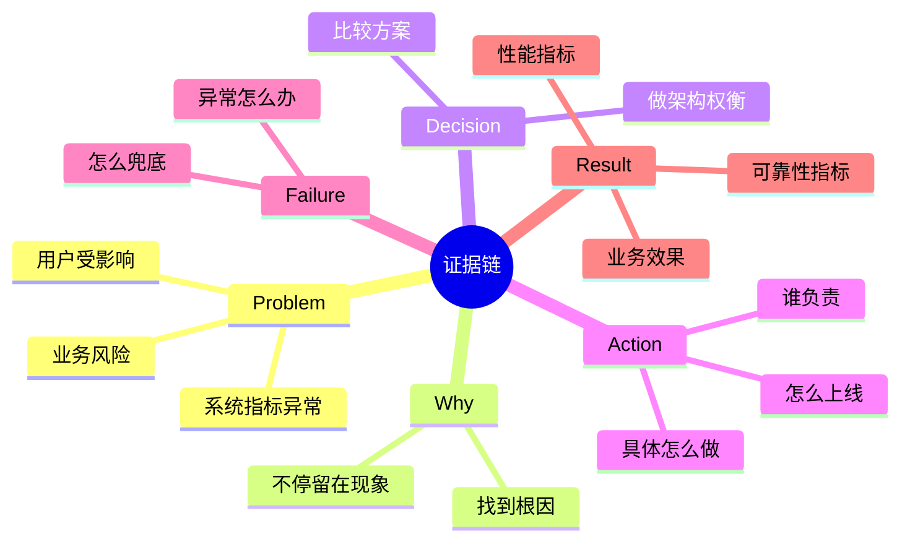
```mermaid
mindmap
  root((证据链))
    Problem
      用户受影响
      系统指标异常
      业务风险
    Why
      找到根因
      不停留在现象
    Decision
      比较方案
      做架构权衡
    Action
      具体怎么做
      谁负责
      怎么上线
    Failure
      异常怎么办
      怎么兜底
    Result
      性能指标
      可靠性指标
      业务效果
```

高分语言不是：

> “我们使用 Redis 提高性能。”

而是：

> “产品配置和公共参数重复查询造成数据库读压力上升，因此将低频变更、高频读取数据下沉 Redis；核心账务状态仍以数据库为权威源，并通过失效补偿保证一致性。”

---

# 11. 结尾：写“架构认识”，不要再复述问题

## 【资料原意】

结尾应该：

- 总结技术应用成果
- 总结项目效益
- 写技术落地感悟
- 为后续优化留空间

资料明确提示：不要再用烂大街的“项目还存在以下问题”。

### 思维导图：结尾

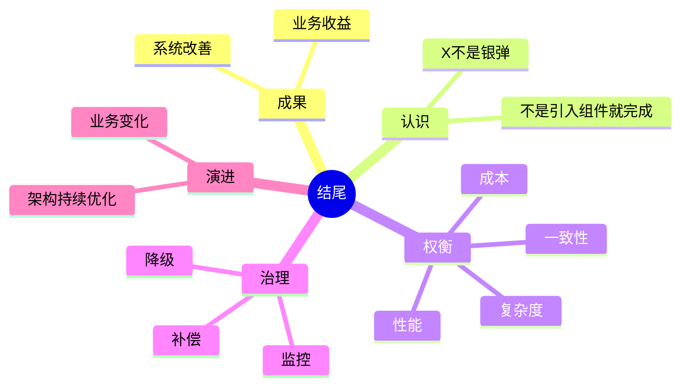
```mermaid
mindmap
  root((结尾))
    成果
      系统改善
      业务收益
    认识
      X不是银弹
      不是引入组件就完成
    权衡
      性能
      一致性
      成本
      复杂度
    治理
      监控
      降级
      补偿
    演进
      业务变化
      架构持续优化
```

---

# 12. 评分标准反推写作策略

## 资料评分权重

- 切合题意：约 30%
- 应用深度与水平：约 20%
- 实践性：约 20%
- 表达：约 15%
- 综合分析：约 15%

### 思维导图：评分 → 写法

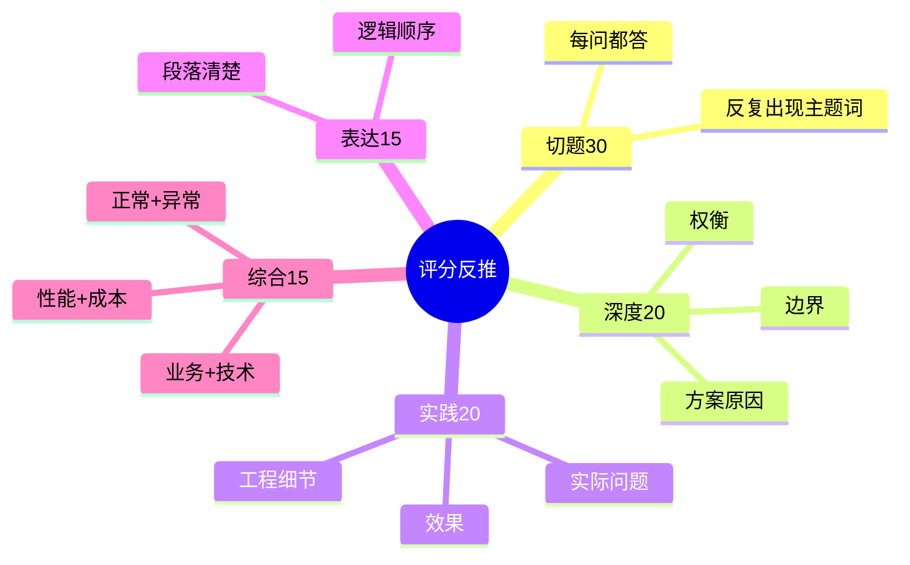
```mermaid
mindmap
  root((评分反推))
    切题30
      每问都答
      反复出现主题词
    深度20
      方案原因
      权衡
      边界
    实践20
      工程细节
      实际问题
      效果
    表达15
      逻辑顺序
      段落清楚
    综合15
      业务+技术
      性能+成本
      正常+异常
```

---

# 13. 自查：写完以后必须做什么？

### 思维导图：考场自查

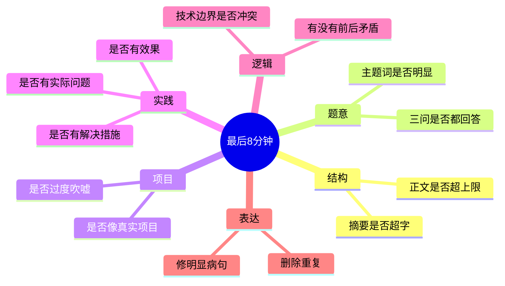
```mermaid
mindmap
  root((最后8分钟))
    结构
      摘要是否超字
      正文是否超上限
    题意
      三问是否都回答
      主题词是否明显
    项目
      是否像真实项目
      是否过度吹嘘
    实践
      是否有实际问题
      是否有解决措施
      是否有效果
    逻辑
      有没有前后矛盾
      技术边界是否冲突
    表达
      删除重复
      修明显病句
```

---

# 14. 押题资料怎么用：不要“押一篇背一篇”

## 【资料原意】

2026 押题资料的组织方式：

> **母题 → 重点方向 → 知识讲解 → 参考范文**

资料明确说明：

- 具体押题和范文优先级最高
- 母题资料用于理解工程细节
- 考试可能换名称、换背景、换角度
- 范文不能直接照搬
- 必须做项目个性化

### 思维导图：押题资料学习方法

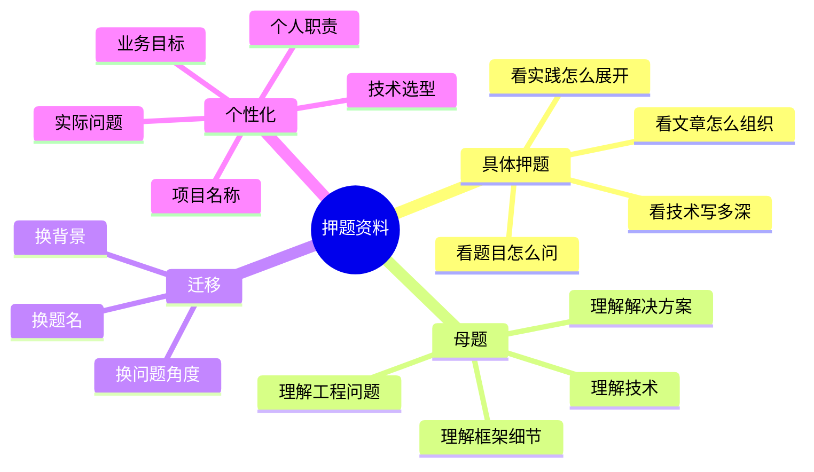
```mermaid
mindmap
  root((押题资料))
    具体押题
      看题目怎么问
      看文章怎么组织
      看技术写多深
      看实践怎么展开
    母题
      理解技术
      理解工程问题
      理解解决方案
      理解框架细节
    迁移
      换题名
      换背景
      换问题角度
    个性化
      项目名称
      业务目标
      个人职责
      技术选型
      实际问题
```

---

# 15. 母题一：RAG

## 需要掌握

- 异构文档解析与清洗
- Chunk 切分
- Embedding / 向量化
- 向量检索、关键词检索、混合检索
- Top-K
- Rerank
- 上下文窗口控制
- 引用与可追溯
- 幻觉抑制
- 权限隔离
- 数据更新

## 消费金融落地点

- 产品制度
- 运营规范
- 客服知识
- 流程手册
- 内部制度问答

### 思维导图：RAG

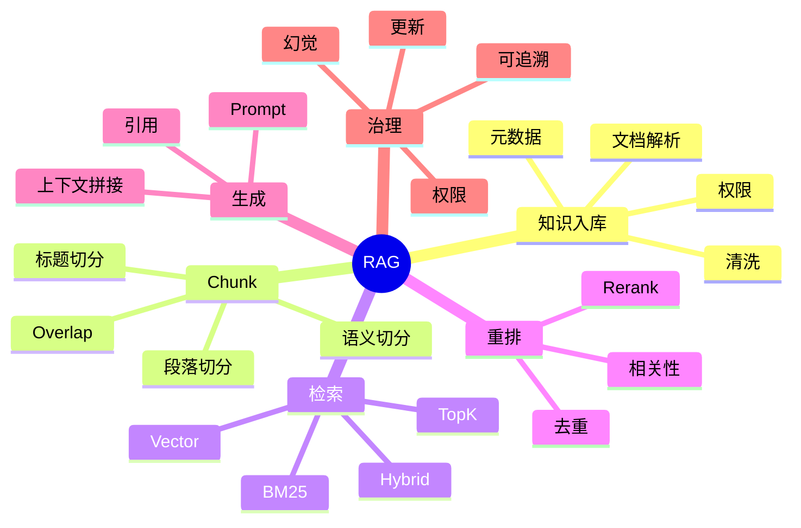
```mermaid
mindmap
  root((RAG))
    知识入库
      文档解析
      清洗
      元数据
      权限
    Chunk
      标题切分
      段落切分
      语义切分
      Overlap
    检索
      Vector
      BM25
      Hybrid
      TopK
    重排
      Rerank
      去重
      相关性
    生成
      上下文拼接
      Prompt
      引用
    治理
      幻觉
      权限
      可追溯
      更新
```

---

# 16. 母题二：Agent

## 需要掌握

- 任务规划
- ReAct / Plan-Execute
- 工具注册与 Tool Calling
- 参数 Schema
- 权限控制
- 超时
- 重试
- 幂等
- 状态管理
- 短期/长期记忆
- Human-in-the-loop
- 审计
- 防止死循环

## 消费金融落地点

建议写低风险内部流程，不让 Agent 自动做核心授信决策。

例如：

- 客服辅助
- 运营工单
- 内部知识查询
- 报表生成
- 流程辅助

### 思维导图：Agent

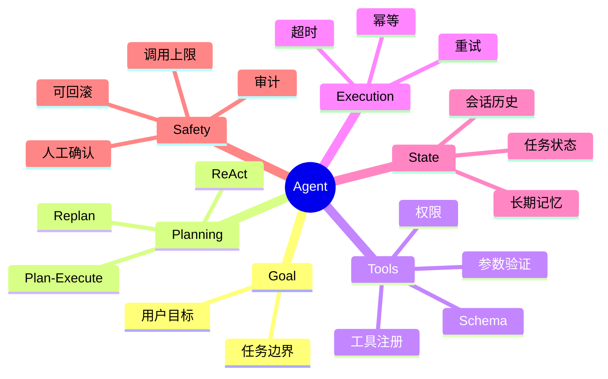
```mermaid
mindmap
  root((Agent))
    Goal
      用户目标
      任务边界
    Planning
      ReAct
      Plan-Execute
      Replan
    Tools
      工具注册
      Schema
      参数验证
      权限
    Execution
      超时
      重试
      幂等
    State
      任务状态
      会话历史
      长期记忆
    Safety
      人工确认
      可回滚
      审计
      调用上限
```

---

# 17. 母题三：分布式缓存

## 需要掌握

- 缓存客户端
- Redis 集群
- 数据库权威源
- Cache-Aside
- Key 设计
- TTL
- 淘汰
- 穿透
- 击穿
- 雪崩
- 热 Key
- 大 Key
- 缓存一致性
- 高可用
- 降级

## 消费金融适合缓存

- 产品配置
- 公共字典
- 渠道参数
- 低频变化规则

不应只依赖缓存判断：

- 放款最终状态
- 借据核心状态
- 核心账务金额

### 思维导图：分布式缓存

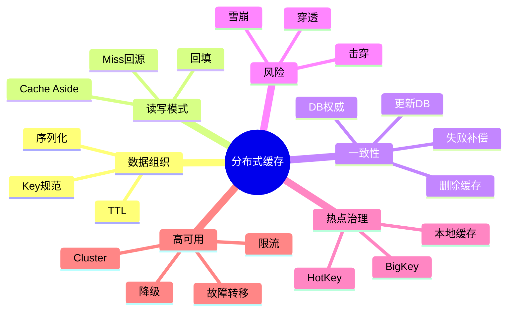
```mermaid
mindmap
  root((分布式缓存))
    数据组织
      Key规范
      序列化
      TTL
    读写模式
      Cache Aside
      Miss回源
      回填
    一致性
      DB权威
      更新DB
      删除缓存
      失败补偿
    风险
      穿透
      击穿
      雪崩
    热点治理
      HotKey
      BigKey
      本地缓存
    高可用
      Cluster
      故障转移
      限流
      降级
```

---

# 18. 母题四：消息队列

## 需要掌握

- Producer
- Broker
- Topic/Queue
- Consumer
- 异步处理
- 应用解耦
- 流量削峰
- 路由
- 可靠投递
- ACK
- 重试
- 死信
- 重复消费
- 幂等
- 顺序
- 积压
- 补偿

## 消费金融落地点

适合异步：

- 消息通知
- 贷后任务
- 对账后处理
- 非核心状态传播

核心交易不要“为了 MQ 而 MQ”。

### 思维导图：消息队列

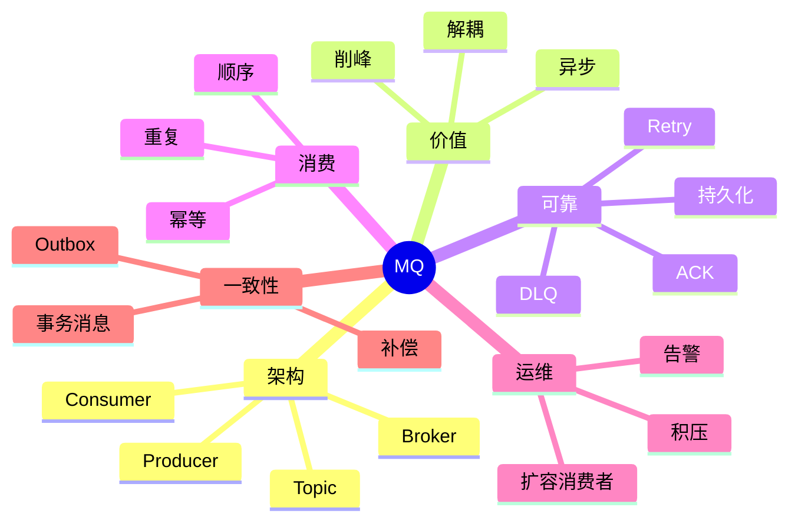
```mermaid
mindmap
  root((MQ))
    架构
      Producer
      Broker
      Topic
      Consumer
    价值
      异步
      解耦
      削峰
    可靠
      持久化
      ACK
      Retry
      DLQ
    消费
      幂等
      重复
      顺序
    运维
      积压
      扩容消费者
      告警
    一致性
      事务消息
      Outbox
      补偿
```

---

# 19. 母题五：弹性伸缩

## 需要掌握

- 指标采集
- 伸缩策略
- 资源调度
- CPU / 内存 / QPS / 延迟 / 队列长度
- 扩容阈值
- 缩容阈值
- 冷却时间
- 防抖
- 无状态化
- 预热
- 容量规划
- 成本权衡

### 思维导图：弹性伸缩

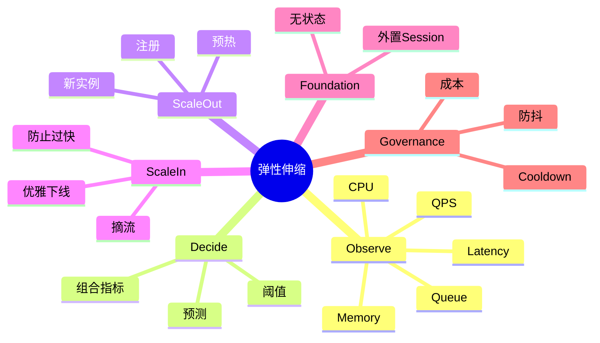
```mermaid
mindmap
  root((弹性伸缩))
    Observe
      CPU
      Memory
      QPS
      Latency
      Queue
    Decide
      阈值
      预测
      组合指标
    ScaleOut
      新实例
      注册
      预热
    ScaleIn
      摘流
      优雅下线
      防止过快
    Foundation
      无状态
      外置Session
    Governance
      Cooldown
      防抖
      成本
```

---

# 20. 母题六：DDD

## 需要掌握

战略设计：

- Domain
- Subdomain
- Core / Supporting / Generic
- Bounded Context
- Ubiquitous Language
- Context Map

战术设计：

- Entity
- Value Object
- Aggregate
- Aggregate Root
- Domain Service
- Domain Event
- Repository

## 消费金融领域示例

- 客户域
- 风控域
- 授信域
- 额度域
- 借款域
- 账务域
- 还款域
- 贷后域

### 思维导图：DDD

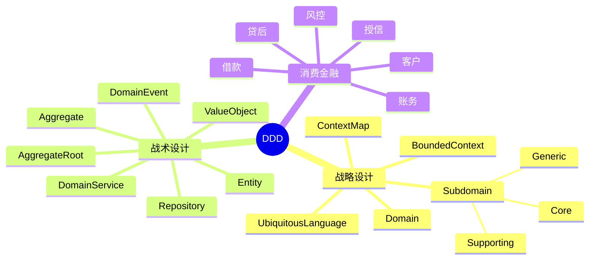
```mermaid
mindmap
  root((DDD))
    战略设计
      Domain
      Subdomain
        Core
        Supporting
        Generic
      BoundedContext
      UbiquitousLanguage
      ContextMap
    战术设计
      Entity
      ValueObject
      Aggregate
      AggregateRoot
      DomainService
      DomainEvent
      Repository
    消费金融
      客户
      风控
      授信
      借款
      账务
      贷后
```

---

# 21. 母题七：分布式一致性

## 需要掌握

- 一致性为什么出现问题
- 网络超时
- 服务故障
- 消息重复
- 并发
- 强一致
- 最终一致
- CAP / BASE
- 本地事务
- TCC
- Saga
- 事务消息
- Outbox
- 幂等
- 重试
- 补偿
- 对账
- 人工兜底

## 消费金融核心判断

先问：

> 哪些数据必须立即一致？

例如核心资金/账务场景要求更严格。

再问：

> 哪些数据可以最终一致？

例如部分通知、分析、异步状态传播。

### 思维导图：分布式一致性

```mermaid
mindmap
  root((分布式一致性))
    原因
      网络
      服务故障
      重复消息
      并发
    一致性级别
      强一致
      最终一致
    方案
      TCC
      Saga
      事务消息
      Outbox
    正确性
      幂等
      状态机
    恢复
      Retry
      Compensation
      Reconciliation
      Manual
    核心
      先划一致性边界
      再选技术
```

---

# 22. 母题八：微服务

## 需要掌握

- 服务拆分
- 业务能力边界
- 数据自治
- 注册发现
- API Gateway
- REST/gRPC
- 消息通信
- 配置中心
- 限流
- 熔断
- 降级
- 链路追踪
- 日志
- 指标
- 灰度
- 容器化
- 故障隔离

### 思维导图：微服务

```mermaid
mindmap
  root((微服务))
    拆分
      业务能力
      DDD边界
      数据自治
    通信
      REST
      gRPC
      MQ
    服务治理
      注册发现
      Gateway
      Config
    韧性
      限流
      熔断
      降级
      重试
    可观测
      Logs
      Metrics
      Tracing
    交付
      容器
      灰度
      独立部署
```

---

# 23. 八大押题之间不是孤立的

### 思维导图：知识关联

```mermaid
mindmap
  root((八大押题关系))
    复杂业务
      DDD
      微服务
    服务协作
      MQ
      分布式一致性
    高并发
      Redis
      弹性伸缩
    AI应用
      RAG
      Agent
    共同治理
      可靠性
      可观测
      安全
      权限
      成本
      降级
```

---

# 24. 一篇论文的“架构决策链”

任何技术题都可以套这一条思考链：

### 思维导图：架构决策

```mermaid
mindmap
  root((架构决策链))
    Business
      业务目标是什么
    Constraint
      有什么限制
      合规
      成本
    Quality
      性能
      可靠性
      一致性
      安全
    Options
      方案A
      方案B
    Tradeoff
      为什么选A
      放弃了什么
    Implementation
      如何落地
    Operation
      如何监控
      异常怎么处理
    Result
      技术指标
      业务价值
```

---

# 25. 记忆策略：不要背全文，背“树”

### 思维导图：考场记忆树

```mermaid
mindmap
  root((看到题目))
    摘要
      项目
      角色
      三问题
      效果
    背景
      业务
      痛点
      职责
    理论
      定义
      组成
      机制
    实践
      P1
      P2
      P3
    结尾
      成果
      权衡
      演进
```

每个主题再准备一棵“主题树”。

这样记忆量远低于背 8 篇 × 2500 字。

---

# 26. Work 任务拆分

## Phase 1：建立稳定项目底座

- [ ] 能闭眼写出消费金融完整业务链
- [ ] 能解释七层总体架构
- [ ] 能说明自己的架构职责
- [ ] 固定摘要模板
- [ ] 固定背景模板
- [ ] 固定结尾模板

**验收标准：**
不看材料，15 分钟内写出“项目背景 + 总体架构”600～800 字。

## Phase 2：掌握论文写作机制

- [ ] 学会拆三问
- [ ] 理论段五步法
- [ ] 实践段六步证据链
- [ ] 至少写出一个“真实问题排查”段
- [ ] 学会写架构权衡
- [ ] 完成自查清单

**验收标准：**
给任意技术题，10 分钟形成完整提纲。

## Phase 3：八大押题逐一攻克

每个主题完成：

- [ ] 主题思维导图
- [ ] 20 个关键词
- [ ] 3 个核心实践
- [ ] 1 个异常案例
- [ ] 1 份 800～1000 字核心实践
- [ ] 1 篇完整论文

顺序建议：

1. 分布式缓存
2. 消息队列
3. 分布式一致性
4. 微服务
5. DDD
6. 弹性伸缩
7. RAG
8. Agent

## Phase 4：迁移能力

- [ ] 把缓存题改写成“高并发”
- [ ] 把 MQ 题迁移成“事件驱动”
- [ ] 把 DDD 题迁移成“复杂业务建模”
- [ ] 把微服务题迁移成“可扩展/高可用”
- [ ] 把 RAG 题迁移到“企业知识库”
- [ ] 把 Agent 题迁移到“智能流程自动化”

**验收标准：**
题目换名字后，5 分钟内能识别属于哪个母题。

## Phase 5：考场模拟

每两天完成 1 篇：

- [ ] 10 分钟审题 + 提纲
- [ ] 10 分钟摘要
- [ ] 15 分钟背景
- [ ] 15～20 分钟理论
- [ ] 45～50 分钟核心实践
- [ ] 10 分钟结尾
- [ ] 8～10 分钟检查

**验收标准：**
120 分钟内稳定完成，摘要不超 300，正文不超 2500。

---

# 27. 你当前最优先掌握的 10 个“元知识”

1. 三问必须逐一回应
2. 实践性和真实性优先
3. 摘要是全篇预告，不是背景缩写
4. 背景写业务价值与系统范围，不堆技术
5. 理论只写到够支持实践
6. 核心实践必须形成“问题—原因—方案—实施—异常—效果”
7. 必须写架构权衡，不写“用了 X 所以很好”
8. 消费金融必须体现风控、账务、一致性、合规
9. iOS 细节只能作为工程证据，不能成为论文主视角
10. 押题要按母题迁移，不要死背单篇范文

### 思维导图：10 个元知识

```mermaid
mindmap
  root((论文元知识))
    切题
      三问
    可信
      真实实践
    结构
      摘要
      背景
      理论
      实践
      结尾
    证据
      问题到效果
    权衡
      不是银弹
    项目特色
      消费金融
      风控
      账务
      合规
    视角
      架构师
    迁移
      母题
      变题
```

---

# 28. 最终训练目标

考前你应该做到：

> 看到任何一道押题，5～10 分钟内完成：

1. 判断属于哪个母题；
2. 写出题目三问；
3. 从消费金融项目里选出最适合的业务场景；
4. 定下三个实践分论点；
5. 每个分论点能写“问题—原因—方案—实施—异常—效果”；
6. 使用固定摘要、背景和结尾；
7. 120 分钟内完成整篇。

真正需要背的不是 8 篇文章，而是：

> **一个真实项目 + 一套写作算法 + 八棵技术树。**
